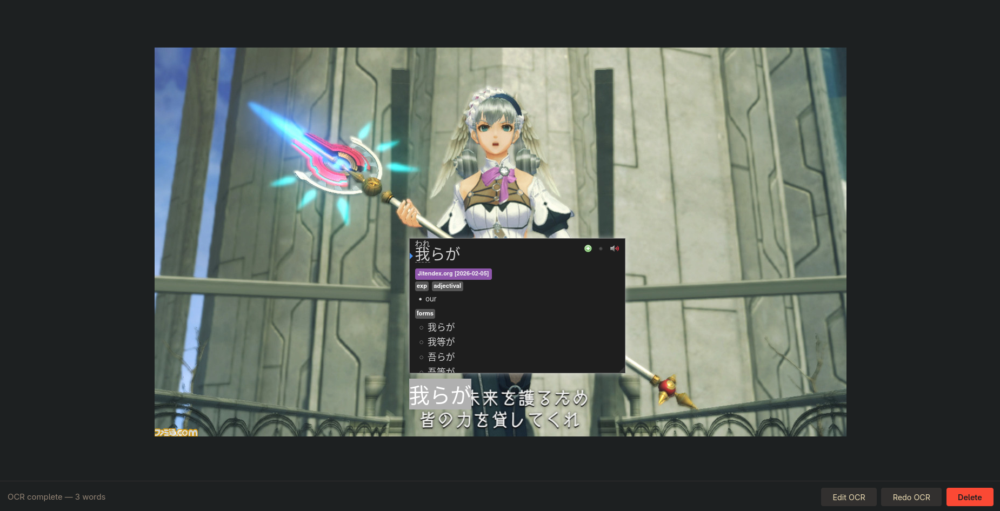
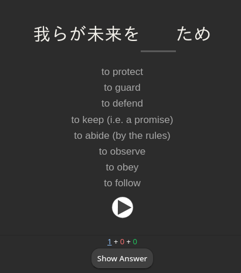
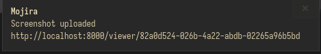
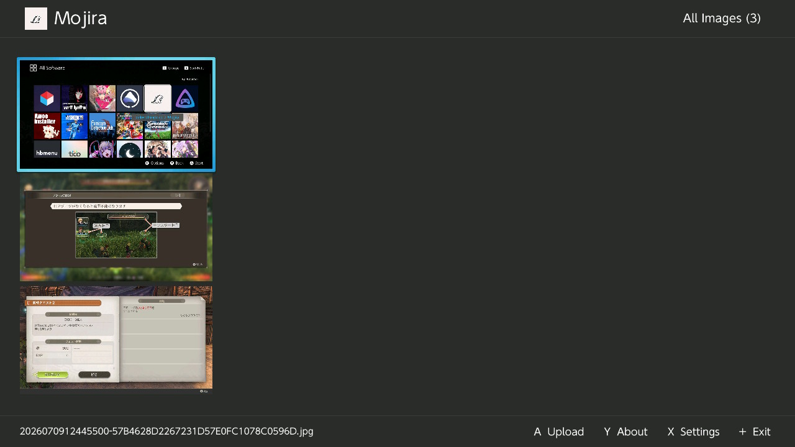

# Mojira -「モジラ」 Sentence mining for language learners

**Mojira** is a self-hosted Docker service that accepts screenshots, runs OCR, and renders selectable text over the image so [Yomitan](https://github.com/themoeway/yomitan) can look up words for Anki card creation.

**This project supports all 80+ languages that EasyOCR supports.**

## Installation Instructions

Create a `docker-compose.yml` file like the following.

```yaml
services:
  api:
    image: colechiodo/mojira:api-latest
    ports:
      - "8000:8000"
    volumes:
      - ./data:/data              # uploaded images + OCR results
      - ./frontend/static:/app/static   # CSS/JS/assets (hot-reload)
      - ./api/app:/app/app        # API code (hot-reload)
      - ./shared:/shared          # shared Pydantic schemas
    environment:
      - OCR_URL=http://ocr:5000
      - DATA_DIR=/data
      - PYTHONPATH=/shared
    depends_on:
      - ocr
    restart: unless-stopped

  ocr:
    image: colechiodo/mojira:ocr-latest
    volumes:
      - ./data:/data
      - ./ocr/app:/app/app        # OCR code (hot-reload)
      - ./shared:/shared
    environment:
      - DATA_DIR=/data
      - PYTHONPATH=/shared
      - OCR_LANGUAGES=ja          # Your target language
    restart: unless-stopped
```

> [!IMPORTANT]
> `OCR_LANGUAGES` uses the language codes as defined in the [EasyOCR docs](https://www.jaided.ai/easyocr/).

Create a `captures` folder in your data directory:

```
mkdir -p data/captures
```

Then while in the same folder as the docker-compose.yml run:

```
docker compose up
```

> [!TIP]
> To run the container in background add -d to the above command.

> [!NOTE]
> First startup downloads EasyOCR models (~2 min).

Visit **http://localhost:8000** and upload a screenshot. The viewer will show invisible selectable text once OCR finishes.

## Anki

This pipeline is was made so I can easily make Anki Cards. I use [Yomitan](https://github.com/themoeway/yomitan) to do most of the Anki integration.
To copy my workflow, do the following:
1. Install my Anki card template at [anki/](/anki), and connect to Yomitan
2. After uploading screenshot, copy the screenshot to your clipboard, and use Yomitan to highlight an unknown word, clicking the green plus.




## How it works

Upload → image saved → background task sends to EasyOCR service (2× upscale → CLAHE → sharpen → crop) → word bounding boxes + text returned → overlay renders transparent `<span>` elements positioned at each bbox → Yomitan picks up the text on hover.

---

## API

| Method | Path | Description |
|--------|------|-------------|
| `GET` | `/` | Gallery + upload |
| `POST` | `/captures` | Upload screenshot (multipart `image` field) |
| `GET` | `/viewer/{id}` | Standalone viewer |
| `GET` | `/captures/{id}/ocr` | OCR JSON (polls until ready) |
| `PUT` | `/captures/{id}/ocr` | Edit OCR text |
| `POST` | `/captures/{id}/ocr` | Redo OCR |
| `DELETE` | `/captures/{id}` | Delete capture |

Sends a **303 redirect** to the viewer URL on successful upload. No auth required.

# Capture Clients

| [Arch/Hyprland](https://github.com/ColeChiodo/dotfiles/blob/main/hypr/.config/hypr/scripts/mojira-capture) | [Mojira-nx - Switch Homebrew](https://github.com/ColeChiodo/mojira-nx) |
|---|---|
|  |  |

## Create your own Client.

This is an example capture script that I have added to my Arch Hyprland environment to take screenshots and upload while I play a game using a single Hotkey.

```bash
#!/usr/bin/env bash
SERVER="${MOJIRA_URL:-http://localhost:8000}"
TMPFILE=$(mktemp /tmp/screenshot-XXXXXX.png)
grim "$TMPFILE"                              # or your screenshot tool
URL=$(curl -s -o /dev/null -w "%{redirect_url}" \
    -X POST "$SERVER/captures" -F "image=@$TMPFILE")
rm "$TMPFILE"
notify-send "Mojira" "Screenshot uploaded\n$URL"
```

Then, after my gaming session, I review all of my screenshots and create Anki cards.

> [!TIP]
> Learn more about my environment at [colechiodo/dotfiles](https://github.com/ColeChiodo/dotfiles)

**© [colechiodo.cc](https://colechiodo.cc) | MIT License**
